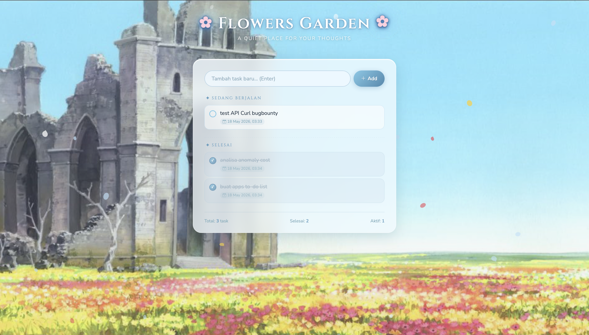

# 🌸 Flowers Garden — To-Do App

Aplikasi to-do list bertema padang bunga di salah satu anime kesukaanku - Sousou no Frieren, dibangun dengan Flask + SQLite + Bootstrap 5.

## Fitur
- ✅ Tambah, edit, hapus task
- ✿ Task selesai dicoret dan turun ke bawah 
- 📅 Tanggal created & updated per task
- 🖼️ Background gambar lokal 
- 🌸 Efek kelopak bunga melayang 
- 💾 Data tersimpan di SQLite



## Cara Jalankan

### Dengan Docker (recommended)
```bash
git clone <repo-url>
cd flowers-todo
docker-compose up --build
```
Buka browser: **http://localhost:8088**

### Tanpa Docker (local dev)
```bash
cd Flowers-todo
pip install -r requirements.txt
flask run
```


## Setup Background Image

1. Simpan gambar background ke folder:
   ```
   app/static/bg.jpg
   ```
2. Jika nama file berbeda (`.png`, `.webp`, dll), sesuaikan satu baris di `index.html`:
   ```css
   background-image: url('/static/bg.jpg'); /* ganti sesuai nama file */
   ```
3. Restart container:
   ```bash
   docker-compose restart
   ```

Flask otomatis melayani file statis dari folder `app/static/` via path `/static/`.

## Struktur
```
Flowers-todo/
├── Dockerfile
├── docker-compose.yml
├── requirements.txt
└── app/
    ├── __init__.py        # Flask factory + SQLAlchemy init
    ├── models.py          # Task model
    ├── routes.py          # CRUD API endpoints
    ├── static/
    │   └── bg.jpg         # Background image (letakkan file di sini)
    └── templates/
        └── index.html     # UI (Bootstrap 5 + vanilla JS)
```

## API Endpoints
| Method | Path | Deskripsi |
|--------|------|-----------|
| GET | `/` | Halaman utama |
| GET | `/tasks` | Ambil semua task |
| POST | `/tasks` | Buat task baru |
| PUT | `/tasks/<id>` | Update task (toggle/edit) |
| DELETE | `/tasks/<id>` | Hapus task |
